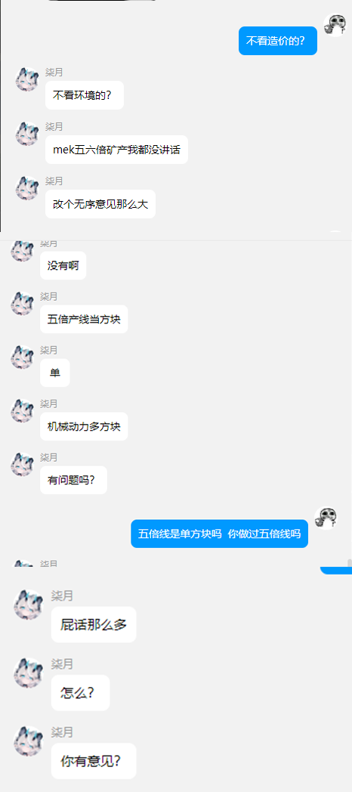
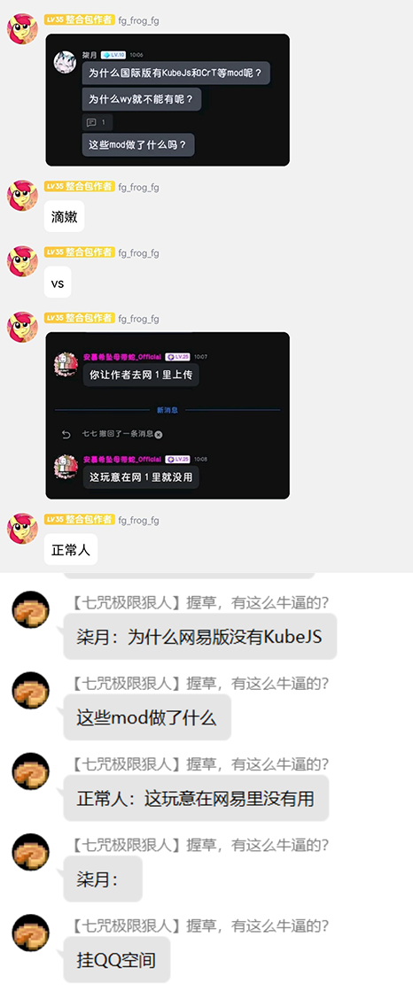
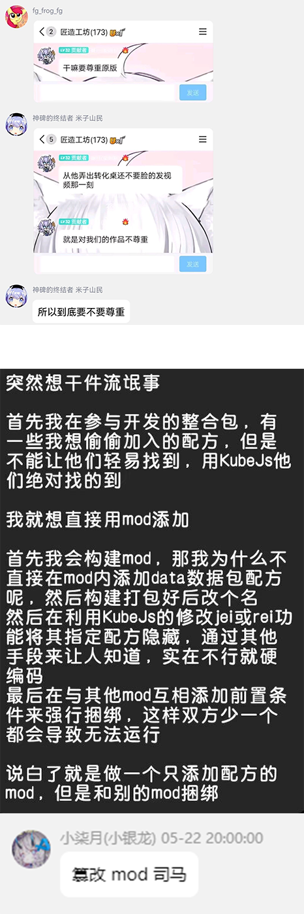
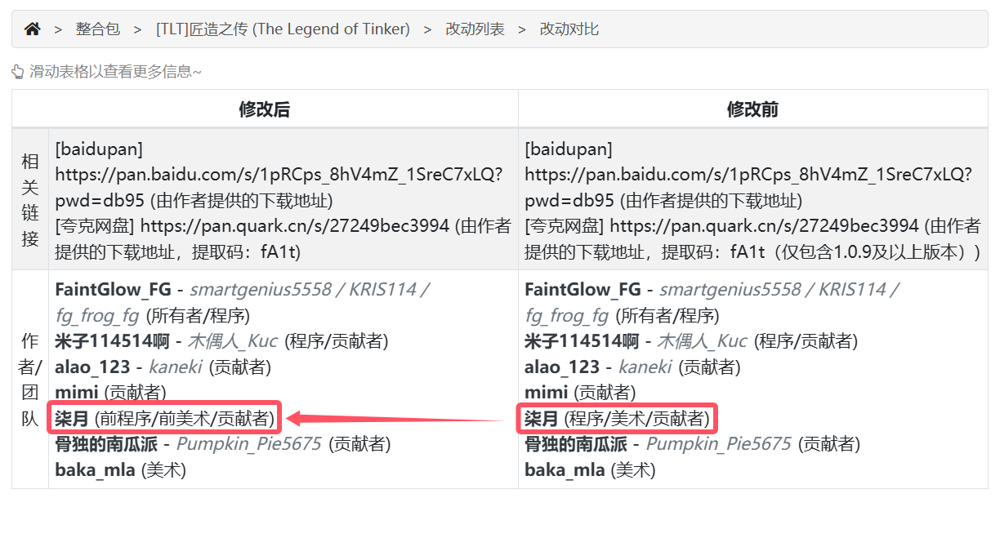
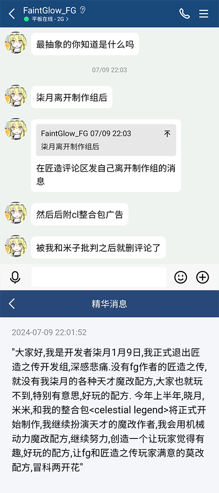

# 【合订本】柒月相关事件全梳理

## 1.匠造之传

2023年11月，柒月加入匠造之传制作组，以开发/美术职位活跃。然而，其在群聊中的部分发言十分荒谬，有些甚至“令人忍俊不禁”。

### 《MEK五六倍矿产我都没讲话》

> 
>
> *注:虽然MEK的五倍线主要处理机器均为单方块，然而，为了维持五倍线需要用到的配套设施（如盐化塔）包含多方块，详情可见[mekanism板块教程索引](https://www.mcmod.cn/post/1479.html)中提及的“MEK的3~5倍矿物处理线”。*

&nbsp;

### 《为什么网易没有魔改mod》

> 
>
> *家人们谁懂啊，今天遇到一个下头男说我dinner；我在此澄清一下，dinner是早餐的意思……*

&nbsp;

### 《自相矛盾》

> 
>
> *你是真没见过All Rights Reserved嗷*

&nbsp;

看到这里你可能会想：这么牛（shen）逼（quan）的制作者，一定还留在匠造之传制作组，为整合包添砖加瓦吧？嘿嘿错了，其实ta在2024年1月的时候就自行退出了匠造之传制作组。

> 
>
>  *[匠造之传](https://www.mcmod.cn/modpack/684.html)在2024年1月23日（修改后）与2024年1月1日（修改前）的改动对比，*

然而，柒月的整活并没结束：在退出制作组之后，ta在匠造之传的短评区发表了一段伟论———
&nbsp;

### 《今年下半年……》

> 
>
>*注1：截图中“大家好，我是开发者柒月……”段落并非柒月在mcmod短评区发表的原文，而是某位群友（姑且隐去其名）根据原文所作的二创。请读者注意甄别。*
>
>*注2：关于整合包《Celestial Legend》（即[星月传说](https://www.mcmod.cn/modpack/709.html)），笔者并未游玩过该整合包，故不在此做出任何相关评价。*

